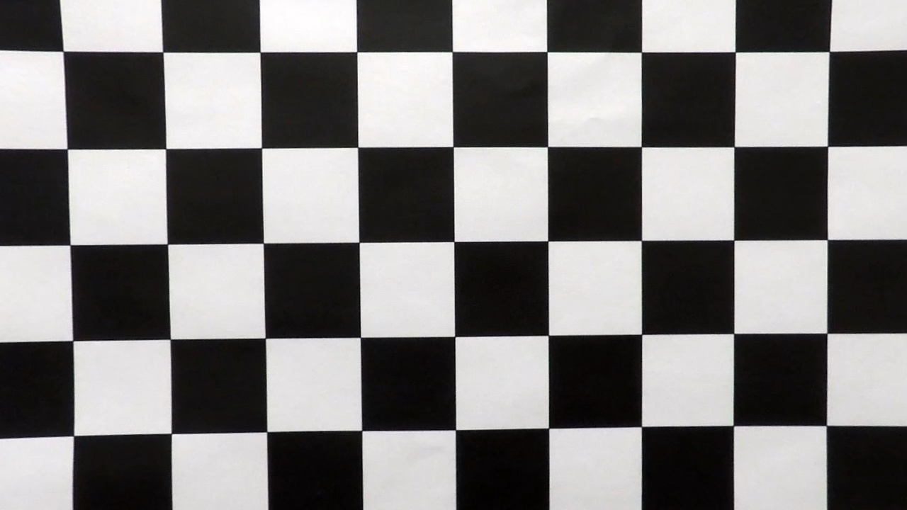

## Writeup

**Advanced Lane Finding Project**

The goals / steps of this project are the following:

* Compute the camera calibration matrix and distortion coefficients given a set of chessboard images.
* Apply a distortion correction to raw images.
* Use color transforms, gradients, etc., to create a thresholded binary image.
* Apply a perspective transform to rectify binary image ("birds-eye view").
* Detect lane pixels and fit to find the lane boundary.
* Determine the curvature of the lane and vehicle position with respect to center.
* Warp the detected lane boundaries back onto the original image.
* Output visual display of the lane boundaries and numerical estimation of lane curvature and vehicle position.

[//]: # (Image References)

[video1]: ./output1_tracked.mp4 "Video"

### Camera Calibration

#### 1. Briefly state how you computed the camera matrix and distortion coefficients. Provide an example of a distortion corrected calibration image.

The code for this step is contained in `cameracaliberation.py`

Camera is prone to create distortions while capturing images from the real word and in this step followed the lecture and corrected the distortions of th test images by caliberating the camera using chessboard images. The "object points", which will be the (x, y, z) coordinates of the chessboard corners in the world. The chessboard is fixed on the (x, y) plane at z=0, such that the object points are the same for each calibration image.  Thus, `objp` is just a replicated array of coordinates, and `objpoints` will be appended with a copy of it every time the chessboard corners is successfuly detected in a test image.  `imgpoints` will be appended with the (x, y) pixel position of each of the corners in the image plane with each successful chessboard detection.

  | 
---------------------------------------------| -----------------------------------------------------------------

The output `objpoints` and `imgpoints` are used to compute the camera calibration and distortion coefficients using the `cv2.calibrateCamera()` function refer `undistortimages.py`.  The distortion correction is applied to the test image using the `cv2.undistort()` function to obtain this result: 

  | 
---------------------------------------------| -----------------------------------------------------------------


### Pipeline (single images)

#### 1. Provide an example of a distortion-corrected image.

Below is one of the distortion corrected test image where the white vehicle is displayed correctly after distiortion correction refer `undistortimages.py` for opencv code used to correct distortion:

  | 
-------------------------------------- | -----------------------------------------------------------------


#### 2. Describe how (and identify where in your code) you used color transforms, gradients or other methods to create a thresholded binary image.  Provide an example of a binary image result.

As suggested in the lecture video a combination of color and gradient thresholds to generate a binary image (thresholding steps at lines # 46 # 87 `combinethresholds.py`). The 'S' and 'V' color channels are used to make sure the lanes are still present after this step and also gradient absolute theshold is applied as well and following is the output after this step:

  | 
-------------------------------------- | -----------------------------------------------------------------
  | 

#### 3. Describe how (and identify where in your code) you performed a perspective transform and provide an example of a transformed image.

The code for perspective transform is included in a function called `pipeline()`, which appears in lines 64 through 79 in the file `laneimageprocessor.py`.  The `pipeline` function takes as inputs an image (`img`) after combine threshold image processing step and hard coded src and dst points is chosen as below for the transformation

```python
src = np.float32(
    [[(img_size[0] / 2) - 55, img_size[1] / 2 + 100],
    [((img_size[0] / 6) - 10), img_size[1]],
    [(img_size[0] * 5 / 6) + 60, img_size[1]],
    [(img_size[0] / 2 + 55), img_size[1] / 2 + 100]])
dst = np.float32(
    [[(img_size[0] / 4), 0],
    [(img_size[0] / 4), img_size[1]],
    [(img_size[0] * 3 / 4), img_size[1]],
    [(img_size[0] * 3 / 4), 0]])
```

This resulted in the following source and destination points:

| Source        | Destination   | 
|:-------------:|:-------------:| 
| 585, 460      | 320, 0        | 
| 203, 720      | 320, 720      |
| 1127, 720     | 960, 720      |
| 695, 460      | 960, 0        |

The perspective transform was verfied working as expected by drawing the `src` and `dst` points onto a test image and its warped counterpart to verify that the lines appear parallel in the warped image.

  | 
-------------------------------------- | -----------------------------------------------------------------
  | 


#### 4. Describe how (and identify where in your code) you identified lane-line pixels and fit their positions with a polynomial?

The traditional histogram technique is used instead of the convolution technique to identify the pixel corrspond to lane images and those pixels would be reflected as peak values in the histogram. Once those are identified a second order polynomial function is used to fit the line for the lanes. Once the lanes are identified this information is used to prevent exhaustive search in consecutive frames by providing a margin of 100 pixels to search. The code for lane line fitting is in `tracker.py` functions 'search_around_poly', 'find_lane_pixels' and fit_poly'

  | 
-------------------------------------- | -----------------------------------------------------------------

#### 5. Describe how (and identify where in your code) you calculated the radius of curvature of the lane and the position of the vehicle with respect to center.

The radius of curvature is computed as suggested in the lecture using the formula mentioned in [here] https://www.intmath.com/applications-differentiation/8-radius-curvature.php. The `measure_curvature_real`  function has the code to compute radius in `laneimageprocessor.py`

#### 6. Provide an example image of your result plotted back down onto the road such that the lane area is identified clearly.

The binary lane image is unwarped opencv `warpPerspective()` back to the original image by using inverse matric coefficients based on perspective transformation. Also the image is augumented with Radius of curvature and the vehicle positon. This is implemented in 'laneimageprocessor.py' in in lines 77 through 127. Here is an example of my result on a test image:

  | 
-------------------------------------- | -----------------------------------------------------------------

---

### Pipeline (video)

Here's a [link to my video result](./project_video.mp4)

---

### Discussion

#### 1. Briefly discuss any problems / issues you faced in your implementation of this project.  Where will your pipeline likely fail?  What could you do to make it more robust?

My goal was to have the projest work on the non challenge video and was able to successfuly complete it with the above mentioned steps. I'll try on the challenge video by making the pipeline robust remembering the last n best fit lines can smoothen the current frame line computation. Also I am using the histogram technique to identify the lanes and this involves using minpix of 50 to recenter the window and for larger curve this might not met and result in imperfect polynomial fit. Probably using convolution would help in challenge video to solve this problem.

